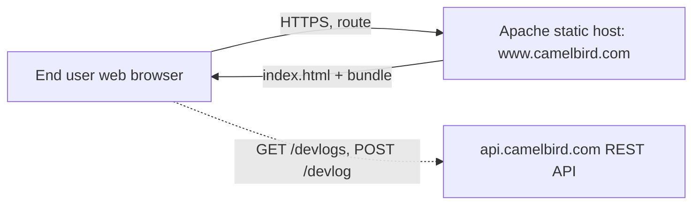
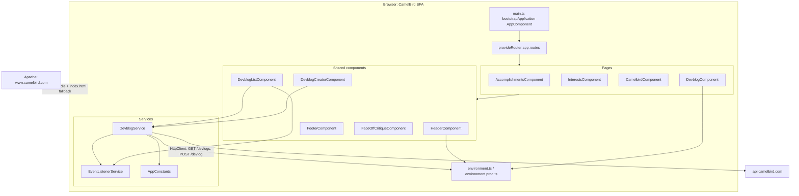
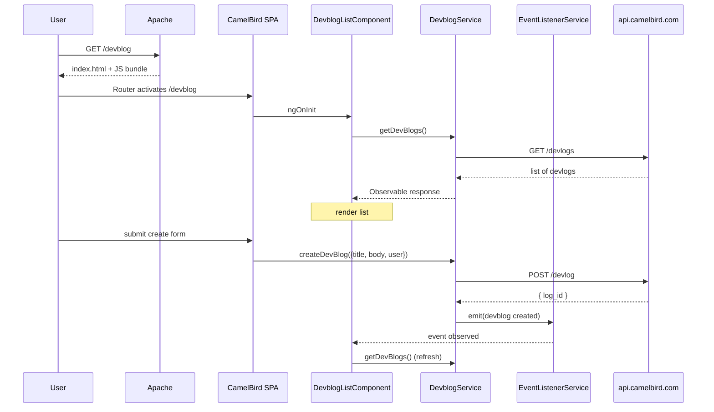

# Architecture: CamelBird

## Document control

- **Target scope**: `whole-repo` — workspace root `e:\Sites\www.camelbird.com`
- **Audience mode**: `architecture-review`
- **Out of scope**: `none`
- **Last reviewed**: 2026-05-13 — **Source**: live analysis (no git SHA captured)
- **Output**: `docs/ARCHITECTURE.md`

### Context from stakeholders

- **Deployment**: confirmed **Apache** (consistent with the in-repo `src/.htaccess`: HTTPS redirect from port 80, asset/dir passthrough, SPA fallback to `/index.html`).

## Executive summary

CamelBird is a small **Angular 20 standalone single-page application** for a personal site (accomplishments, interests, dev blog, branding). The build emits a static bundle to **`dist/CamelBird`** (application builder; browser assets at the project output root) and is served by **Apache** using a `.htaccess` that forces HTTPS and routes unknown paths back to `index.html` for client-side routing. The only dynamic feature is a **dev blog** that calls an external REST API (`environment.apiServerUrl` → `https://api.camelbird.com` in production) for list and create operations; that backend is not in this repository. The codebase is small (≈10 components, 2 services, route config in `app.routes.ts`, 1 constants class) with **Jest** unit tests and **GitHub Actions CI** (`lint`, production `build`, `test`). Remaining architectural watch items include **the UI feature flag (`enableDevlogCreate`) treated as UX-only** (authorization belongs on `api.camelbird.com`). Client-side **logging + HTTP failure interception** and **inline dev-blog errors** are now in place; optional vendor analytics or CSP tightening remains host-dependent—see **`docs/APACHE_CONFIG.md`**.

## Context

External actors and systems:

- **End users** load the static SPA from Apache and interact entirely in the browser.
- **`api.camelbird.com`** is an external service owned outside this repo; only the dev blog feature talks to it.
- **No SSO, identity provider, CDN, or analytics** is observed in the repository.

## Goals and constraints

- **Goal (inferred from code/routes)**: present static personal-site content (`accomplishments`, `interests`, `camelbird`) plus a dynamic `devblog` view.
- **Build constraints (`angular.json`)**:
  - Production budgets: initial bundle warning **1mb** / error **1.25mb**; per-component-style warning 2kb / error 4kb.
  - **Strict mode enabled** at the Angular project level.
  - Production swaps `environment.ts` → `environment.prod.ts` (`fileReplacements`).
- **Hosting constraint**: Apache with `.htaccess`; rewrites assume a single-page fallback to `index.html`.
- **No explicit non-functional requirements** documented in repo.

## High-level architecture

Standalone bootstrap, application routes, one feature service. Two distinct slices: static pages (no I/O) and the dev blog (HTTP + intra-app pub/sub).

Critical-path sequence (load + create dev log):

## Components / services

### Routing and shell

- **`main.ts`** calls `bootstrapApplication(AppComponent, …)` with `provideRouter(routes)`, **`provideHttpClient(withFetch(), withInterceptors([httpErrorInterceptor]))`**.
- **`app.routes.ts`** declares 4 routes plus a default redirect:
  - `''` → redirect `/accomplishments`
  - `accomplishments`, `interests`, `devblog`, `camelbird`
- **Routed/feature components** are **`standalone: true`**; there is no `AppModule`.
- **`AppComponent`** holds layout (header + `RouterOutlet` + footer); footer year computed from `new Date()`.
- **`HeaderComponent`** reads `environment.enableDevBlog` to decide whether the dev blog nav link is shown.
- **`FooterComponent`** — presentational.

### Pages

- **`AccomplishmentsComponent`, `InterestsComponent`, `CamelbirdComponent`** — static content, no inputs or services.
- **`DevblogComponent`** — wraps the dev blog feature; reads `environment.enableDevlogCreate` to enable/disable the creator UI.

### Dev blog feature

- **`DevblogListComponent`** — lists posts, subscribes to `EventListenerService.events$` (filtered devblog `created` events) to refresh after a successful create, formats dates via **date-fns**, owns local `loading` / **`errorMessage`** for UI alerts (`takeUntilDestroyed` for subscriptions); uses **`LoggerService`** on failures.
- **`DevblogCreatorComponent`** — `ReactiveForms` form (`title`, `body` required); hard-codes `user = "dangard"`; calls **`DevblogService.createDevBlog`** (returns **`Observable`**) and surfaces **`submitError`** inline on HTTP failure.
- **`DevblogService`** (`providedIn: 'root'`) — single HTTP gateway for the feature.
  - **Signatures**: typed payloads via `src/app/shared/models/devblog-api.types.ts` — e.g. `getDevBlogs(): Observable<DevBlogListPayload[]>`, **`createDevBlog(...) Observable<CreateDevBlogResponse>`** with **`tap`** for **`log_id`** + **`EventListenerService.emit`**.
  - **Dependencies**: `HttpClient`, `AppConstants`, `EventListenerService`, `environment`.
  - **API contract observed**:
    - `GET {apiServerUrl}/devlogs` → list
    - `POST {apiServerUrl}/devlog` → `{ log_id }`
- **`EventListenerService`** — typed in-app events: `Subject<CamelBirdAppEvent>` exposed as `events$`, `emit(...)`. Payloads are a discriminated union (`src/app/shared/models/app-events.types.ts`); extend the union as new domains appear.
- **`AppConstants`** — injectable REST path fragments (`OPERATIONS`); no runtime env reads.

### Client observability

- **`LoggerService`** (`providedIn: 'root'`) — **`debug` / `info` / `warn` / `error`** with **`[CamelBird]`** prefix (console-backed today; swap internals later for vendors or backends).
- **`httpErrorInterceptor`** (`HttpInterceptorFn`) — logs failed **`HttpClient`** responses via **`LoggerService`** (`main.ts` **`withInterceptors([httpErrorInterceptor])`**).

### Other shared components

- **`FaceOffCritiqueComponent`** — local random-string generator from a hard-coded adjectives list; **no HTTP, no shared state**; effectively a leaf utility component (likely used by a page template; not reachable from a route directly).

### Models

- **`Devblog`** model: simple class with `title`, `body`, `user`, plus `convertToJson()`. No `id` field (`TODO` in code).

## Data architecture

- **Client-side**: No local persistence (no `localStorage`, no NgRx, no service-worker cache). All dev-blog data is fetched per page load via `HttpClient`.
- **Server-side**: Owned by the **external** `api.camelbird.com`; schema and retention not visible in this repository.
- **PII**: The only user-identifying value in the client is the hard-coded string `"dangard"` passed as `user` when creating a dev log. Anything else PII-related would live server-side.

## Security and trust

- **Authentication / authorization**: No Angular **route guards**, **JWT/cookie handling**, or **OAuth flow** observed. **`httpErrorInterceptor`** exists **only** to log failed **`HttpClient`** responses via **`LoggerService`**—not for auth. Requests to `api.camelbird.com` are issued **unauthenticated** from this codebase.
- **Feature flag misuse risk**: `environment.enableDevlogCreate` (`false` in prod) only hides the creator UI; the **API endpoint is still reachable** from a browser. True authorization must be enforced by the API.
- **Transport**:
  - Production API URL is HTTPS.
  - `.htaccess` forces HTTPS on the site itself (`SERVER_PORT 80 → https://www.camelbird.com/`).
- **Secrets**: None checked into source (only the public API hostname).
- **Content security**: No CSP/SRI enforced **in-repo**; **`docs/APACHE_CONFIG.md`** documents optional **`Header`** directives (HSTS, CSP, etc.) for Apache / vhost. **`src/.htaccess`** remains rewrite-focused only.
- **Third-party JS**: **No** global `jquery` / Bootstrap JS in `angular.json`; styling loads **compiled Bootstrap CSS** plus **`src/styles.scss`** (Sass **`@use`** for shared palette tokens).

## Operations and reliability

- **Hosting**: Apache static hosting; **`docs/APACHE_CONFIG.md`** complements **`src/.htaccess`** with vhost/header guidance. `src/.htaccess` is copied into the build via the `assets` array in `angular.json` and provides:
  - HTTPS canonicalization.
  - Pass-through for existing files/dirs.
  - SPA fallback (`RewriteRule ^ /index.html`).
- **Build artifacts**: `dist/CamelBird` (production, with `outputHashing: "all"`; application builder with `outputPath.browser` empty so static files land at this root — same deploy path as before the `browser/` subfolder default).
- **Environments**: only `development` and `production` configurations; no staging configuration in `angular.json`.
- **Health checks, observability, SLOs**: No uptime vendor or analytics in-repo; **`LoggerService`** centralizes browser-console logging hooks and **`httpErrorInterceptor`** records failed HTTP calls for troubleshooting.
- **Error handling**: Dev blog **list** and **creator** surfaces show **`alert-danger`** inline messages on failure; **`LoggerService`** captures structured context alongside interceptor logs.

## Development workflow

- **Run locally**: `npm start` → `ng serve` on `http://localhost:4200/`; dev env points API to `http://localhost`.
- **Build**: `npm run build` → `ng build` (production by default per `defaultConfiguration: "production"`).
- **Watch**: `npm run watch` → `ng build --watch --configuration development`.
- **Lint**: `npm run lint` → `tsc --noEmit && eslint . --ext js,ts,json,html --quiet --fix` (config: `.eslintrc.json` with `@angular-eslint/recommended`).
- **Test**: `npm test` → **`jest --ci --runInBand`** (`jest.config.cjs`, `setup-jest.ts` with zone test env from `jest-preset-angular`).
- **Tests present**: spec files for routed/shared components, **`DevblogService`**, **`EventListenerService`**, and **`LoggerService`** (`*.component.spec.ts`, `*.service.spec.ts`).
- **CI**: `.github/workflows/ci.yml` — Node 20, `npm ci`, lint, production build, Jest (no browser install).
- **IaC**: **None** (no Terraform, Pulumi, Bicep, CloudFormation, K8s manifests).
- **Local-dev tooling**: ESLint + Prettier + TypeScript strict; `.editorconfig`, `.nvmrc` (Node 20), `.gitattributes` (line endings).

## Risks, gaps, and recommendations

Listed roughly by impact for an architecture review.

| # | Issue | Evidence | Recommendation | Trade-off |
|---|-------|----------|----------------|-----------|
| 1 | ~~**EOL Angular toolchain**~~ | *Addressed*: Angular **20**, TypeScript **5.8**, application builder | Stay on supported majors; rerun `ng update` on cadence. | Ongoing upkeep. |
| 2 | ~~**No CI**~~ | *Addressed*: `.github/workflows/ci.yml` | Extend with deploy preview or bundle-size reporting if desired. | More YAML to maintain. |
| 3 | ~~**Untyped HTTP**~~ | *Improved*: `devblog-api.types.ts` + typed `DevblogService` methods | Extend types if API grows; optionally generate from OpenAPI. | Schema/source of truth outside repo. |
| 4 | **Feature flag treated as a control** | `environment.enableDevlogCreate` only hides the creator UI; service still exposes `createDevBlog` | Enforce authorization on `api.camelbird.com`. Keep flag as UX-only; document it is **not** a security boundary. | Server-side effort. |
| 5 | ~~**jQuery + Bootstrap JS**~~ | *Removed* from `angular.json` scripts | N/A unless new global scripts are added. | — |
| 6 | ~~**Monolithic NgModule**~~ | *Addressed*: standalone components + `app.routes.ts` | Optional: lazy routes per feature if bundle grows. | Slight routing churn. |
| 7 | ~~**`EventListenerService` is a string-based bus**~~ | *Addressed*: `CamelBirdAppEvent` discriminated union (`app-events.types.ts`), `emit` / `events$`; removed `AppConstants.EVENTS` | Add variants to the union when new cross-cutting notifications are needed. | Union grows with features. |
| 8 | ~~**No observability**~~ | *Addressed*: **`LoggerService`** + **`httpErrorInterceptor`** (`main.ts`) | Wire **`LoggerService`** to a vendor or backend sink when ready; optional analytics stays separate. | Third-party deps + privacy review. |
| 9 | ~~**Error surfacing is thin**~~ | *Addressed*: **`alert-danger`** on dev-blog **list load** / **create** failures | Consider toasts if UX grows beyond alerts. | Bootstrap JS not bundled today. |
| 10 | ~~**Apache config split**~~ | *Addressed*: **`docs/APACHE_CONFIG.md`** (vhost skeleton, optional HSTS/CSP/header snippets) coexists with **`src/.htaccess`** | Tune CSP/connect-src against real APIs/CDNs before enforcing. | Host-specific tuning. |
| 11 | ~~**Sass deprecations**~~ | *Addressed for app*: SCSS uses **`@use`** only; Bootstrap via **compiled CSS** in **`angular.json`** (no Sass **`@import`** from `node_modules` on this path) | If switching to Bootstrap Sass sources, revisit deprecations upstream. | Upstream Bootstrap timeline. |

### Optional target-state placeholder

Suggested next increments:

- Lazy-loaded routes per feature if initial bundle grows; optional **analytics** + CSP enforcement after validating **`docs/APACHE_CONFIG.md`** snippets.

## Open questions

- **`api.camelbird.com`** — Where is its source, what auth does it require, and who owns it? The behavior here assumes it is open or network-restricted.
- **Apache config** — Prefer **`docs/APACHE_CONFIG.md`** + **`src/.htaccess`** together; note whether production TLS terminates at CDN vs origin so CSP/HSTS apply in the right layer.
- **`FaceOffCritiqueComponent`** — Where is it embedded in templates? It is standalone but not directly attached to a route.
- **`enableDevBlog`** vs **`enableDevlogCreate`** — Are both intended to remain UI-only flags forever, or is one of them headed toward server-side enforcement?
- **Tests** — CI runs Jest on every push/PR via GitHub Actions.
